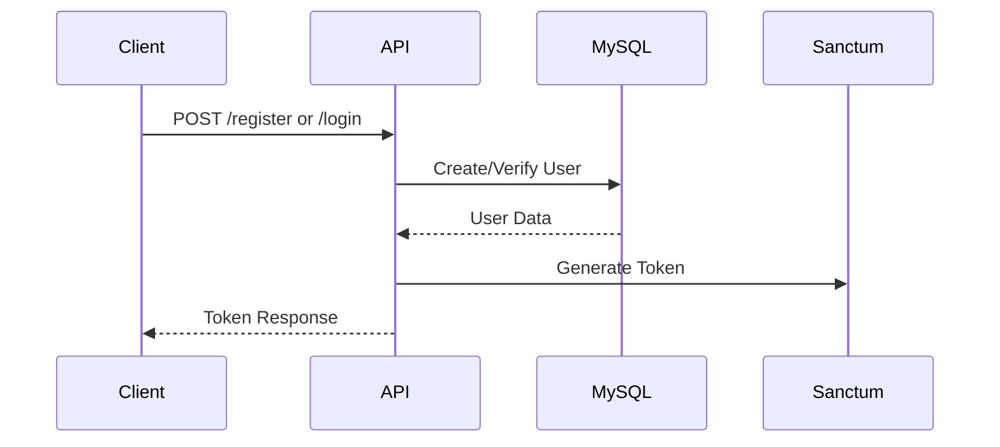
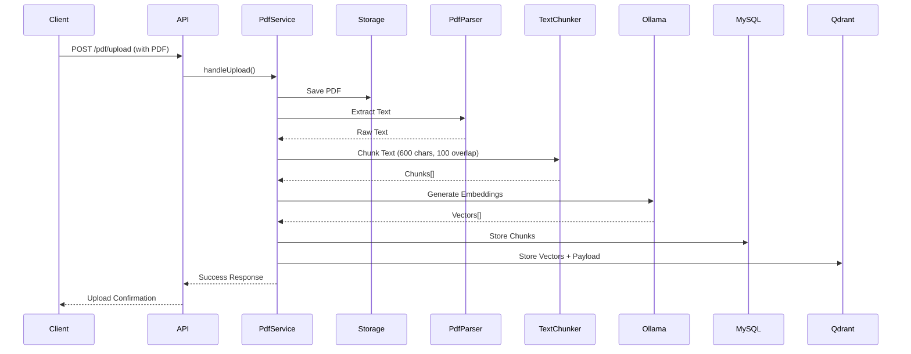
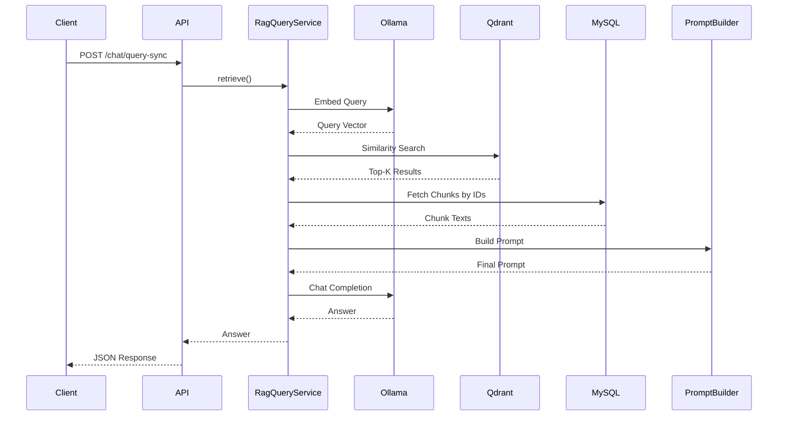

# Mini RAG System with WebSocket Streaming (Laravel)

## 📌 Overview

A **Mini Retrieval-Augmented Generation (RAG) System** built with **Laravel 12** for Madaar Solutions technical assessment.

### Key Features
- ✅ **Secure Authentication:** Token-based with Sanctum
- ✅ **PDF Processing:** Upload, validate, extract, and chunk documents
- ✅ **AI-Powered Search:** Vector similarity using Qdrant + Ollama embeddings
- ✅ **Intelligent Chat:** Context-aware responses from local LLM (Ollama)
- ✅ **Real-time Streaming:** WebSocket responses via Pusher
- ✅ **Production-Ready:** Clean architecture, SOLID principles, comprehensive error handling

> **Note:** This implementation uses **Ollama (local LLM)** instead of OpenAI/HuggingFace to eliminate API costs while maintaining full RAG functionality.

---

## 🏗️ System Architecture

### Tech Stack
- **Backend:** Laravel 12
- **Authentication:** Laravel Sanctum (Token-based)
- **Database:** MySQL (metadata storage)
- **Vector Database:** Qdrant Cloud (embeddings storage)
- **LLM:** Ollama (local - llama3.2)
- **Embeddings:** Ollama (nomic-embed-text)
- **WebSocket:** Pusher
- **PDF Parser:** smalot/pdfparser

## 🚀 Local Setup

### Prerequisites
1. **PHP 8.2+**
2. **Composer**
3. **MySQL**
4. **Ollama** (install from https://ollama.com/download)
5. **Qdrant Cloud** account (free tier)
6. **Pusher** account (free tier)

#### 3. Configure `.env`
```env
# Database
DB_DATABASE=mini_RAG_System_project
DB_USERNAME=root
DB_PASSWORD=your_password

# Qdrant
QDRANT_HOST=https://your-cluster.gcp.cloud.qdrant.io
QDRANT_PORT=6333
QDRANT_API_KEY=your_qdrant_api_key
QDRANT_COLLECTION=mini_rag_chunks

# Ollama
OLLAMA_BASE_URL=http://127.0.0.1:11434
OLLAMA_EMBEDDING_MODEL=nomic-embed-text
OLLAMA_CHAT_MODEL=llama3.2

# Pusher
PUSHER_APP_ID=your_app_id
PUSHER_APP_KEY=your_key
PUSHER_APP_SECRET=your_secret
PUSHER_APP_CLUSTER=your_cluster
BROADCAST_CONNECTION=pusher
```

## 📡 API Endpoints

### Base URL
```
http://127.0.0.1:8000/api/v1
```

### Authentication

#### Register
```http
POST /register
Content-Type: application/json

{
  "name": "Peter joe",
  "email": "Peter@example.com",
  "password": "pass123",
  "password_confirmation": "pass123"
}
```

**Response:**
```json
{
  "key": "success",
  "msg": "User registered successfully",
  "data": {
    "id": 1,
    "name": "Peter joe",
    "email": "Peter@example.com",
    "token": "2|xxxxx..."
  }
}
```

#### Login
```http
POST /login
Content-Type: application/json

{
  "email": "Peter@example.com",
  "password": "pass123"
}
```

**Response:**
```json
{
  "key": "success",
  "msg": "User logged in successfully",
  "data": {
    "id": 1,
    "name": "Peter joe",
    "email": "Peter@example.com",
    "token": "3|xxxxx..."
  }
}
```

### PDF Upload

```http
POST /pdf/upload
Authorization: Bearer {token}
Content-Type: multipart/form-data

pdf: <file>
```

**Response:**
```json
{
  "key": "success",
  "msg": "File uploaded and processed successfully",
  "data": {
    "pdf": {
      "id": 1,
      "user_id": 1,
      "name": "document.pdf",
      "file_path": "images/pdfs/xxx.pdf"
    },
    "chunks_count": 7
  }
}
```

### Chat (Synchronous)

```http
POST /chat/query-sync
Authorization: Bearer {token}
Content-Type: application/json

{
  "query": "What is this document about?",
  "pdf_id": 1
}
```

**Response:**
```json
{
  "key": "success",
  "msg": "Answer generated",
  "data": {
    "query": "What is this document about?",
    "answer": "This document is about...",
    "context_chunks": 5,
    "context_preview": "..."
  }
}
```

### Chat (WebSocket Streaming)

```http
POST /chat/query
Authorization: Bearer {token}
Content-Type: application/json

{
  "query": "What is this document about?",
  "pdf_id": 1
}
```

**Response:**
```json
{
  "key": "success",
  "msg": "Query received, streaming started."
}
```

**WebSocket:**
- Connect to: `private-chat.{userId}`
- Listen for: `.chat.stream`
- Payload:
```json
{
  "chunk": "partial answer...",
  "done": false,
  "error": null
}
```

---

## 🔄 End-to-End Flow

### 1. Authentication


### 2. PDF Upload & Indexing


### 3. Chat Query (RAG)


## 📦 Dependencies

### PHP Packages
- `laravel/framework`: ^12.0
- `laravel/sanctum`: ^4.0 (Authentication)
- `smalot/pdfparser`: PDF text extraction
- `intervention/image`: Image handling
- `laravolt/avatar`: Avatar generation

### External Services
- **Ollama:** Local LLM (free)
- **Qdrant Cloud:** Vector database (free tier)
- **Pusher:** WebSocket service (free tier)

---

## 🔧 Configuration Files

- `config/sanctum.php`: Authentication settings
- `config/qdrant.php`: Qdrant connection
- `config/ollama.php`: Ollama models
- `config/broadcasting.php`: Pusher settings

---


### 5. Chat Response
**Demonstrates:** Context retrieval from Qdrant, LLM generation, and real-time streaming response via WebSocket.


*Answer streams chunk-by-chunk via WebSocket, demonstrating:*
- ✅ User authentication
- ✅ WebSocket connection (Pusher)
- ✅ Vector similarity search (Qdrant)
- ✅ Context building from PDF chunks
- ✅ LLM response generation (Ollama)
- ✅ Real-time streaming to client
- ✅ "Stream ended" confirmation

---

## 📖 Usage Example

### 1. Register & Login
```bash
curl -X POST http://127.0.0.1:8000/api/v1/register \
  -H "Content-Type: application/json" \
  -d '{"name":"Test","email":"test@test.com","password":"12345678","password_confirmation":"12345678"}'
```

### 2. Upload PDF
```bash
curl -X POST http://127.0.0.1:8000/api/v1/pdf/upload \
  -H "Authorization: Bearer YOUR_TOKEN" \
  -F "pdf=@document.pdf"
```

### 3. Chat
```bash
curl -X POST http://127.0.0.1:8000/api/v1/chat/query-sync \
  -H "Authorization: Bearer YOUR_TOKEN" \
  -H "Content-Type: application/json" \
  -d '{"query":"What is this document about?","pdf_id":1}'
```


