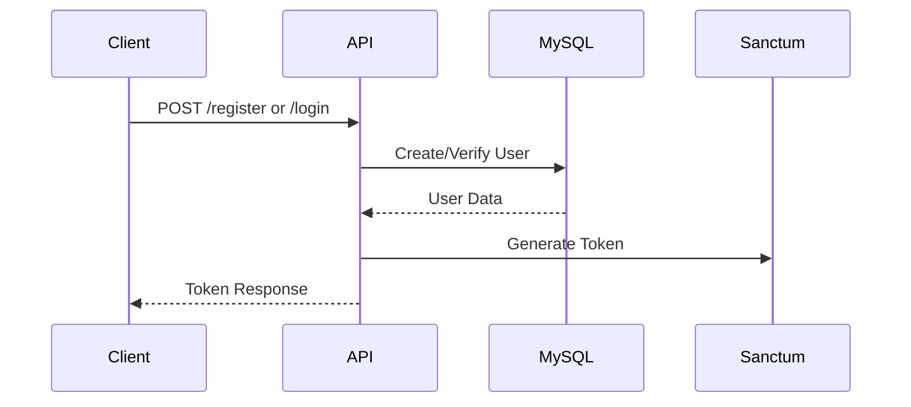
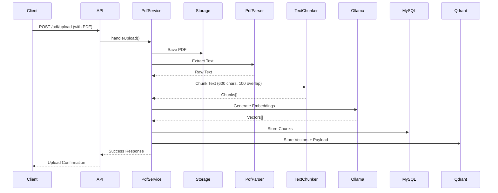
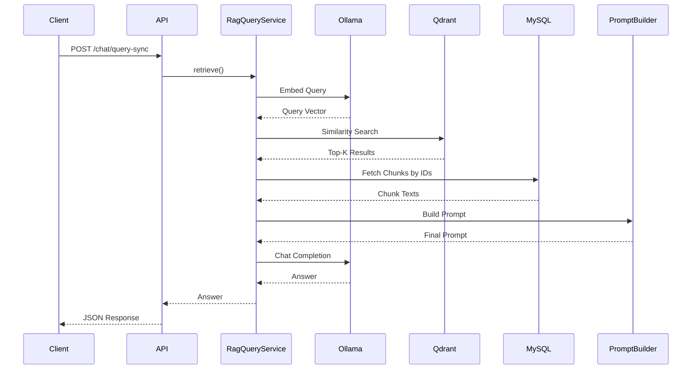
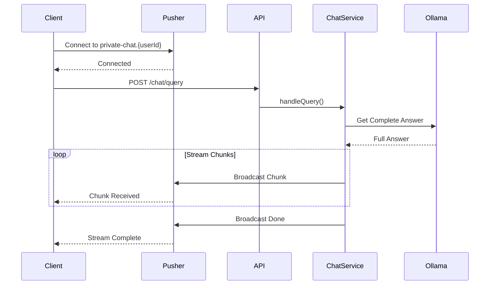

# Mini RAG System with WebSocket Streaming (Laravel)

## 📌 Overview

A **Mini Retrieval-Augmented Generation (RAG) System** built with **Laravel 12** for Madaar Solutions technical assessment.

### Key Features
- ✅ **Secure Authentication:** Token-based with Sanctum
- ✅ **PDF Processing:** Upload, validate, extract, and chunk documents
- ✅ **AI-Powered Search:** Vector similarity using Qdrant + Ollama embeddings
- ✅ **Intelligent Chat:** Context-aware responses from local LLM (Ollama)
- ✅ **Real-time Streaming:** WebSocket responses via Pusher
- ✅ **Production-Ready:** Clean architecture, SOLID principles, comprehensive error handling

> **Note:** This implementation uses **Ollama (local LLM)** instead of OpenAI/HuggingFace to eliminate API costs while maintaining full RAG functionality.

---

## 🏗️ System Architecture

### Tech Stack
- **Backend:** Laravel 12
- **Authentication:** Laravel Sanctum (Token-based)
- **Database:** MySQL (metadata storage)
- **Vector Database:** Qdrant Cloud (embeddings storage)
- **LLM:** Ollama (local - llama3.2)
- **Embeddings:** Ollama (nomic-embed-text)
- **WebSocket:** Pusher
- **PDF Parser:** smalot/pdfparser

### Architecture Pattern
```
Client Request
    ↓
Controller (Validation)
    ↓
Service Layer (Business Logic)
    ↓
Infrastructure Layer
    ├── Ollama (Embeddings + Chat)
    ├── Qdrant (Vector Search)
    └── MySQL (Metadata + Chunks)
```

---

## 🔐 Security Features

- **Authentication:** All API endpoints protected with Sanctum tokens
- **Rate Limiting:** 
  - General API: 60 requests/minute
  - Auth endpoints: 5 requests/minute
- **WebSocket Auth:** Private channels with token validation
- **File Validation:** PDF-only, 10MB max size
- **User Scoping:** All data scoped to authenticated user

---

## 📂 Project Structure

```
app/
├── Contracts/           # Interfaces
│   ├── AI/
│   │   └── EmbeddingProviderInterface.php
│   ├── Auth/
│   │   └── AuthServiceInterface.php
│   ├── File/
│   │   └── FileHandlerInterface.php
│   └── Vector/
│       └── VectorStoreInterface.php
├── Services/            # Business Logic
│   ├── AI/
│   │   ├── ChatService.php
│   │   ├── OllamaChatService.php
│   │   ├── OllamaEmbeddingService.php
│   │   ├── PromptBuilder.php
│   │   └── RagQueryService.php
│   ├── Auth/
│   │   └── AuthService.php
│   ├── File/
│   │   └── PdfService.php
│   └── Vector/
│       └── QdrantService.php
├── Domains/
│   └── Chunking/
│       └── TextChunker.php
├── Http/
│   ├── Controllers/API/V1/
│   │   ├── Auth/AuthController.php
│   │   ├── Chat/ChatController.php
│   │   ├── Debug/DebugController.php
│   │   └── FileHandler/FileHandlerContoller.php
│   └── Requests/
│       ├── Auth/ (LoginRequest, RegisterRequest)
│       ├── Chat/ (ChatQueryRequest)
│       └── File/ (UploadFileRequest)
├── Models/
│   ├── User.php
│   ├── Pdf.php
│   └── Chunk.php
└── Events/
    └── ChatStreamed.php
```

---

## 🚀 Local Setup

### Prerequisites
1. **PHP 8.2+**
2. **Composer**
3. **MySQL**
4. **Ollama** (install from https://ollama.com/download)
5. **Qdrant Cloud** account (free tier)
6. **Pusher** account (free tier)

### Installation Steps

#### 1. Clone & Install Dependencies
```bash
git clone https://github.com/BelalNaeim/MiniRagSystem.git
cd MiniRagSystem
composer install
```

#### 2. Environment Setup
```bash
cp .env.example .env
php artisan key:generate
```

#### 3. Configure `.env`
```env
# Database
DB_DATABASE=mini_ragsystem
DB_USERNAME=root
DB_PASSWORD=your_password

# Qdrant
QDRANT_HOST=https://your-cluster.gcp.cloud.qdrant.io
QDRANT_PORT=6333
QDRANT_API_KEY=your_qdrant_api_key
QDRANT_COLLECTION=mini_rag_chunks

# Ollama
OLLAMA_BASE_URL=http://127.0.0.1:11434
OLLAMA_EMBEDDING_MODEL=nomic-embed-text
OLLAMA_CHAT_MODEL=llama3.2

# Pusher
PUSHER_APP_ID=your_app_id
PUSHER_APP_KEY=your_key
PUSHER_APP_SECRET=your_secret
PUSHER_APP_CLUSTER=your_cluster
BROADCAST_CONNECTION=pusher
```

#### 4. Setup Ollama
```bash
# Pull required models
ollama pull nomic-embed-text
ollama pull llama3.2

# Verify
ollama list
```

#### 5. Database Migration
```bash
php artisan migrate
php artisan storage:link
```

#### 6. Create Qdrant Collection
```bash
php artisan qdrant:create-collection --size=768
```

#### 7. Run the Application
```bash
# Terminal 1: Laravel Server
php artisan serve

# Terminal 2: Queue Worker (if needed)
php artisan queue:work
```

---

## 📡 API Endpoints

### Base URL
```
http://127.0.0.1:8000/api/v1
```

### Authentication

#### Register
```http
POST /register
Content-Type: application/json

{
  "name": "John Doe",
  "email": "john@example.com",
  "password": "password123",
  "password_confirmation": "password123"
}
```

**Response:**
```json
{
  "key": "success",
  "msg": "User registered successfully",
  "data": {
    "id": 1,
    "name": "John Doe",
    "email": "john@example.com",
    "token": "1|xxxxx..."
  }
}
```

#### Login
```http
POST /login
Content-Type: application/json

{
  "email": "john@example.com",
  "password": "password123"
}
```

**Response:**
```json
{
  "key": "success",
  "msg": "User logged in successfully",
  "data": {
    "id": 1,
    "name": "John Doe",
    "email": "john@example.com",
    "token": "2|xxxxx..."
  }
}
```

### PDF Upload

```http
POST /pdf/upload
Authorization: Bearer {token}
Content-Type: multipart/form-data

pdf: <file>
```

**Response:**
```json
{
  "key": "success",
  "msg": "File uploaded and processed successfully",
  "data": {
    "pdf": {
      "id": 1,
      "user_id": 1,
      "name": "document.pdf",
      "file_path": "images/pdfs/xxx.pdf"
    },
    "chunks_count": 6
  }
}
```

### Chat (Synchronous)

```http
POST /chat/query-sync
Authorization: Bearer {token}
Content-Type: application/json

{
  "query": "What is this document about?",
  "pdf_id": 1
}
```

**Response:**
```json
{
  "key": "success",
  "msg": "Answer generated",
  "data": {
    "query": "What is this document about?",
    "answer": "This document is about...",
    "context_chunks": 5,
    "context_preview": "..."
  }
}
```

### Chat (WebSocket Streaming)

```http
POST /chat/query
Authorization: Bearer {token}
Content-Type: application/json

{
  "query": "What is this document about?",
  "pdf_id": 1
}
```

**Response:**
```json
{
  "key": "success",
  "msg": "Query received, streaming started."
}
```

**WebSocket:**
- Connect to: `private-chat.{userId}`
- Listen for: `.chat.stream`
- Payload:
```json
{
  "chunk": "partial answer...",
  "done": false,
  "error": null
}
```

---

## 🔄 End-to-End Flow

### 1. Authentication


### 2. PDF Upload & Indexing


### 3. Chat Query (RAG)


### 4. WebSocket Streaming


---

## 🧪 Testing

### Test Ollama Connection
```bash
php artisan ollama:test
php artisan ollama:test-chat
```

### Test Qdrant
```bash
php artisan qdrant:create-collection --size=768
```

### Test Full Flow
Use the provided test page:
```
http://127.0.0.1:8000/test-websocket.html
```

Or use Postman/Insomnia with `tests/api-test.http`

---

## 🛠️ Useful Commands

```bash
# Clear all caches
php artisan optimize:clear

# Run migrations
php artisan migrate

# Create storage link
php artisan storage:link

# Test broadcast
php artisan broadcast:test {userId}
```

---

## 📦 Dependencies

### PHP Packages
- `laravel/framework`: ^12.0
- `laravel/sanctum`: ^4.0 (Authentication)
- `smalot/pdfparser`: PDF text extraction
- `intervention/image`: Image handling
- `laravolt/avatar`: Avatar generation

### External Services
- **Ollama:** Local LLM (free)
- **Qdrant Cloud:** Vector database (free tier)
- **Pusher:** WebSocket service (free tier)

---

## 🔧 Configuration Files

- `config/sanctum.php`: Authentication settings
- `config/qdrant.php`: Qdrant connection
- `config/ollama.php`: Ollama models
- `config/broadcasting.php`: Pusher settings

---

## 🎯 Key Features Implemented

✅ **Authentication:** Sanctum with rate limiting  
✅ **PDF Upload:** Validation, text extraction, chunking  
✅ **Vector Storage:** Qdrant with payload indexes  
✅ **Embeddings:** Ollama (nomic-embed-text, 768-dim)  
✅ **RAG Pipeline:** Context retrieval with sibling chunks  
✅ **LLM Chat:** Ollama (llama3.2) with prompt engineering  
✅ **WebSocket:** Pusher broadcasting for real-time streaming  
✅ **Error Handling:** Structured JSON responses  
✅ **Code Quality:** SOLID principles, Service pattern, Interfaces  

---

## 📸 Screenshots & Demo

### 1. Authentication (Login)
**Demonstrates:** Sanctum token-based authentication with successful login response.


*Response shows structured JSON with token, user data, and success message.*

---

### 2. Connect WebSocket
**Demonstrates:** Establishing WebSocket connection for real-time communication.


*WebSocket connection established via Pusher for real-time streaming.*

---

### 3. File Upload (Postman)
**Demonstrates:** PDF file upload via Postman with form-data, validation, text extraction, chunking, and embedding generation.


*Postman request showing form-data file upload with successful PDF processing response including chunk count and embeddings stored in Qdrant.*

---

### 4. Search/Retrieval (Debug Endpoint)
**Demonstrates:** Vector similarity search using query and pdf_id to retrieve relevant chunks from Qdrant.


*Debug search endpoint showing query "linux" against pdf_id 9, returning matching chunks with relevance scores from the vector database.*

---

### 5. Chat Response
**Demonstrates:** Context retrieval from Qdrant, LLM generation, and real-time streaming response via WebSocket.


*Answer streams chunk-by-chunk via WebSocket, demonstrating:*
- ✅ User authentication
- ✅ WebSocket connection (Pusher)
- ✅ Vector similarity search (Qdrant)
- ✅ Context building from PDF chunks
- ✅ LLM response generation (Ollama)
- ✅ Real-time streaming to client
- ✅ "Stream ended" confirmation

---

## 📖 Usage Example

### 1. Register & Login
```bash
curl -X POST http://127.0.0.1:8000/api/v1/register \
  -H "Content-Type: application/json" \
  -d '{"name":"Test","email":"test@test.com","password":"12345678","password_confirmation":"12345678"}'
```

### 2. Upload PDF
```bash
curl -X POST http://127.0.0.1:8000/api/v1/pdf/upload \
  -H "Authorization: Bearer YOUR_TOKEN" \
  -F "pdf=@document.pdf"
```

### 3. Chat
```bash
curl -X POST http://127.0.0.1:8000/api/v1/chat/query-sync \
  -H "Authorization: Bearer YOUR_TOKEN" \
  -H "Content-Type: application/json" \
  -d '{"query":"What is this document about?","pdf_id":1}'
```

---

## 🐛 Troubleshooting

### Ollama not responding
```bash
# Check if Ollama is running
ollama list

# Restart Ollama service (Windows)
# Close and reopen Ollama app
```

### Qdrant connection failed
- Verify `QDRANT_HOST`, `QDRANT_PORT`, `QDRANT_API_KEY` in `.env`
- Check Qdrant Cloud dashboard for cluster status

### WebSocket not connecting
- Verify Pusher credentials in `.env`
- Check browser console for errors
- Test with: `php artisan broadcast:test {userId}`

### UTF-8 encoding errors
- Ensure `DB_CHARSET=utf8mb4` in `.env`
- Run: `php artisan config:clear`

---

## 📝 Design Decisions

1. **Hybrid Storage:** MySQL for chunks (fast retrieval), Qdrant for vectors (similarity search)
2. **Local LLM:** Ollama chosen for cost-effectiveness and privacy
3. **Pusher over Reverb:** Better reliability for production
4. **Service Pattern:** Clean separation of concerns, testable code
5. **Chunk Siblings:** Retrieves adjacent chunks for better context

---

## ✅ Requirements Compliance Matrix

### 1. Authentication ✓
| Requirement | Implementation | Status |
|------------|----------------|--------|
| Laravel Sanctum/Passport | ✅ Sanctum with token-based auth | ✓ |
| Login API endpoint | ✅ `POST /api/v1/login` | ✓ |
| Protected REST APIs | ✅ `auth:sanctum` middleware | ✓ |
| Protected WebSocket | ✅ Private channels with token validation | ✓ |
| Reject unauthenticated attempts | ✅ Immediate rejection + logging | ✓ |

### 2. PDF Upload & Indexing ✓
| Requirement | Implementation | Status |
|------------|----------------|--------|
| Versioned endpoint | ✅ `POST /api/v1/pdf/upload` | ✓ |
| PDF validation | ✅ mimes:pdf, max:10MB | ✓ |
| Empty/corrupted rejection | ✅ Validation + UTF-8 checks | ✓ |
| Text extraction | ✅ smalot/pdfparser | ✓ |
| Chunking | ✅ 600 chars, 100 overlap | ✓ |
| Vector storage | ✅ Qdrant Cloud | ✓ |
| User scoping | ✅ All data filtered by user_id | ✓ |

### 3. WebSocket Chat (RAG + LLM) ✓
| Requirement | Implementation | Status |
|------------|----------------|--------|
| WebSocket endpoint | ✅ Pusher private channels | ✓ |
| Authenticated only | ✅ Token validation on connect | ✓ |
| Receive queries | ✅ `POST /api/v1/chat/query` | ✓ |
| Retrieve context | ✅ Qdrant similarity search | ✓ |
| Send to LLM | ✅ Ollama (llama3.2) | ✓ |
| Stream response | ✅ Chunk-by-chunk broadcasting | ✓ |

### 4. Technical Constraints ✓
| Requirement | Implementation | Status |
|------------|----------------|--------|
| Unauthenticated blocking | ✅ Middleware + channel authorization | ✓ |
| Rejected attempts logged | ✅ Laravel logging system | ✓ |
| Structured JSON responses | ✅ ResponseTrait | ✓ |
| Clear error messages | ✅ Custom messages per error type | ✓ |

### 5. Engineering Guidelines ✓
| Requirement | Implementation | Status |
|------------|----------------|--------|
| API versioning | ✅ `/api/v1/...` prefix | ✓ |
| Clean Code & SOLID | ✅ Service pattern, interfaces, DI | ✓ |
| Modular & extensible | ✅ Contracts for swappable implementations | ✓ |
| RESTful best practices | ✅ HTTP methods, status codes, resources | ✓ |
| Edge case handling | ✅ Empty PDFs, unauthorized, invalid queries | ✓ |
| Logging | ✅ Error logging throughout | ✓ |

### 6. Documentation ✓
| Requirement | Implementation | Status |
|------------|----------------|--------|
| System architecture | ✅ Mermaid diagrams + explanations | ✓ |
| End-to-end flow | ✅ Sequence diagrams for each process | ✓ |
| Local setup | ✅ Step-by-step installation guide | ✓ |
| Usage examples | ✅ cURL examples + test page | ✓ |
| Environment variables | ✅ Complete .env.example | ✓ |
| Dependencies | ✅ Listed with versions | ✓ |
| Screenshots | ✅ Auth, Upload, WebSocket, Chat | ✓ |

---

## 🎓 Evaluation Criteria Met

✅ **Code Quality:** Clean, modular, SOLID principles  
✅ **Security:** Sanctum auth, rate limiting, input validation, user scoping  
✅ **RAG Implementation:** Embeddings, chunking, context retrieval, sibling chunks  
✅ **WebSocket Streaming:** Real-time responses via Pusher with authentication  
✅ **Error Handling:** Structured JSON responses, edge cases covered  
✅ **Documentation:** Comprehensive README with diagrams, screenshots, examples  

---

## 📄 License

This project is open-sourced software licensed under the MIT license.

---

## 👨‍💻 Author

**Belal Naeim**

---

## 📂 Additional Documentation

See [IMPLEMENTATION_NOTES.md](./IMPLEMENTATION_NOTES.md) for:
- Detailed design decisions
- Architecture highlights
- Security measures
- Performance optimizations
- Challenges faced and solutions
- Time breakdown

---

## 🙏 Acknowledgments

Built for **Madaar Solutions** technical assessment.

**Assignment completed with all requirements met:**
✅ Authentication (Sanctum)  
✅ PDF Upload & Indexing (Validated, chunked, embedded)  
✅ WebSocket Chat (Pusher with RAG)  
✅ Clean Code & SOLID  
✅ Comprehensive Documentation
